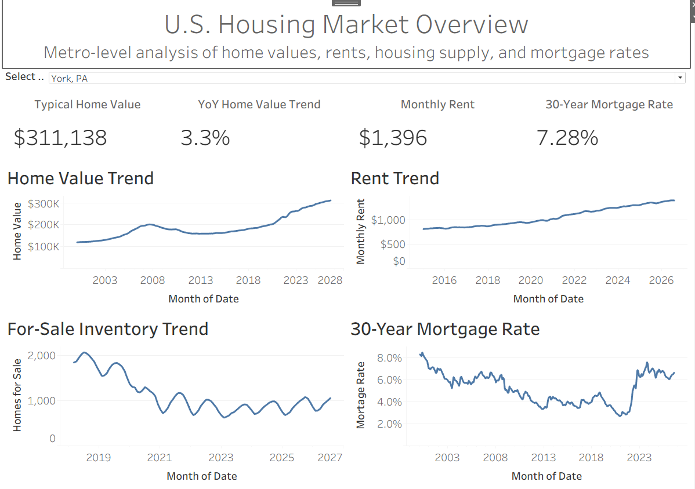
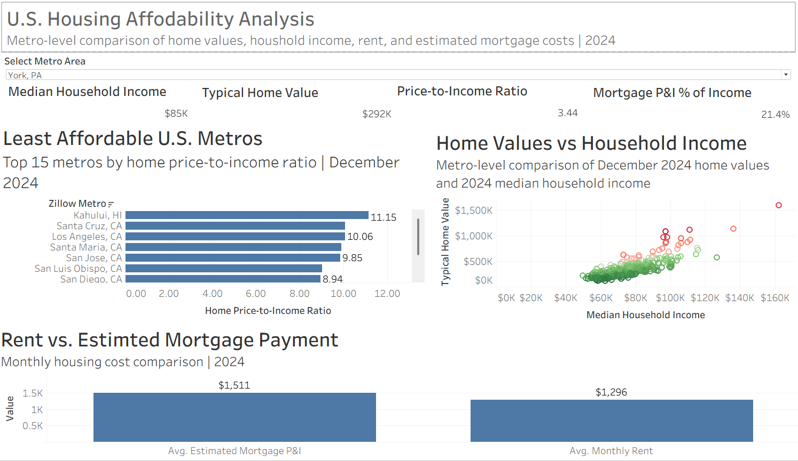
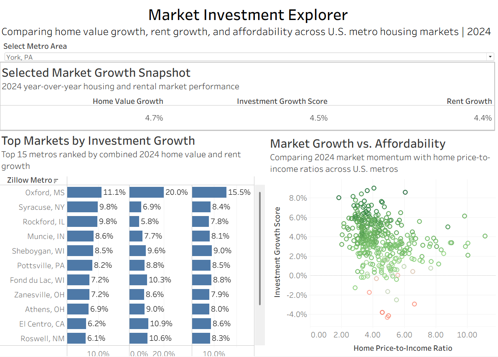
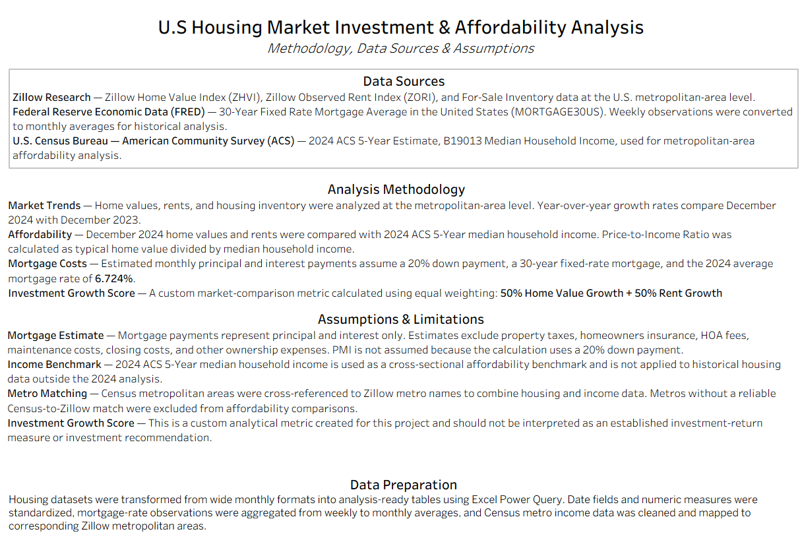

# U.S. Housing Market Investment & Affordability Analysis

An interactive Tableau data analytics project examining housing market trends, affordability, and investment growth across U.S. metropolitan areas.

## Project Overview

This project combines housing, rental, inventory, mortgage rate, and household income data to evaluate conditions across U.S. housing markets.

The analysis was designed to answer three primary questions:

1. How have home values, rents, housing inventory, and mortgage rates changed over time?
2. How affordable are U.S. metropolitan housing markets relative to household income?
3. Which metropolitan areas demonstrate the strongest combination of home value appreciation and rental growth?

The project includes three interactive analytical dashboards:

- **U.S. Housing Market Overview** — Historical home value, rent, inventory, and mortgage-rate trends.
- **Housing Affordability Analysis** — Home values and housing costs compared with household income.
- **Market Investment Explorer** — Metro-level comparison of home value growth, rent growth, affordability, and market momentum.

## Tools & Skills

**Tableau** — Dashboard development, calculated fields, parameters, filters, relationships, KPI reporting, and interactive data visualization.

**Excel / Power Query** — Data cleaning, transformation, unpivoting, aggregation, and preparation of analysis-ready datasets.

**Data Modeling** — Integrated Zillow, Census, and FRED data using a custom metropolitan-area crosswalk.

**Financial Analysis** — Housing affordability ratios, estimated mortgage payments, income burden metrics, and market growth analysis.

## Dashboard Preview

### U.S. Housing Market Overview

Tracks metro-level home values, rents, housing inventory, and national mortgage rates over time.

### Housing Affordability Analysis

Compares home values, household income, rent, and estimated mortgage costs to evaluate housing affordability across U.S. metropolitan areas.

### Market Investment Explorer

Compares home value growth, rent growth, affordability, and a custom Investment Growth Score to identify markets demonstrating strong housing and rental momentum.

### Methodology & Data Sources

Documents the datasets, calculations, assumptions, data preparation process, and analytical limitations used throughout the project.

